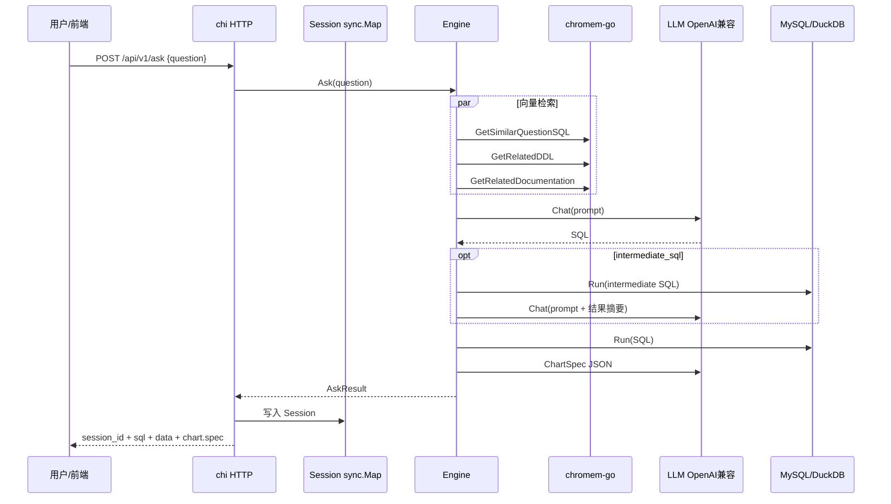

# Vanna Go 重写 — P0 实施计划

> 版本：0.1  
> 状态：实现中（P0 骨架已落地，见 `go/`）  
> 最后更新：2026-07-15

本文档汇总 Go 重写 Vanna 的技术决策、架构设计与 P0 交付范围，作为后续开发的唯一指导来源。实现时若与本文冲突，应先更新本文档再改代码。

---

## 1. 目标与非目标

### 1.1 目标

| 目标 | 说明 |
|------|------|
| 功能等价 | P0 复刻原版 Vanna 核心 Text-to-SQL 能力（除认证外） |
| 简化部署 | 单 Go 二进制，`go:embed` 内嵌前端静态资源 |
| 嵌入式向量库 | 不单独启动 PostgreSQL / Chroma Server 等服务 |
| 可扩展架构 | LLM、Embedder、VectorStore、SQLRunner 均通过接口插拔 |

### 1.2 非目标（P0 不做）

| 项 | 说明 |
|----|------|
| 用户认证 | 原版 Flask `AuthInterface` 不在 P0 实现 |
| 完整多轮对话 | 不维护 LLM 级 message history；保留 `generate_rewritten_question` 弱多轮 |
| Jupyter 集成 | 不提供 Notebook / PNG 图表导出 |
| Plotly 兼容 | 图表改为 ChartSpec + ECharts，不 `exec` Python |
| 全部向量库 / LLM | P0 仅 chromem-go + OpenAI 兼容协议 |

### 1.3 与原版 Vanna 的关系

原版仓库（`src/vanna/`）继续保留 Python 实现。Go 代码建议放在仓库根目录独立目录（见 §4），与 Python 包并存，互不干扰。

---

## 2. 已确认技术决策

| 领域 | 决策 |
|------|------|
| HTTP 框架 | [chi](https://github.com/go-chi/chi) |
| 工作流状态 | 内存 `sync.Map`，`session_id` 由客户端 Header 带回，TTL 30 分钟 |
| LLM（P0） | OpenAI 兼容 Chat Completions；Chat / Embedding 可分别配置 URL 与 Key，也支持统一 `base_url` + `api_key` |
| 向量库（P0） | [chromem-go](https://github.com/philippgille/chromem-go)，持久化至可配置目录 |
| Embedder（P0） | 独立接口，OpenAI 兼容 Embeddings API；默认 `text-embedding-3-small`，维度 1536 |
| 业务数据库（P0） | MySQL、DuckDB；单数据源，启动时配置一个 DSN |
| SQL 方言 | 由连接类型自动推断（`mysql` / `duckdb`），可通过配置覆盖 |
| 图表 | LLM 输出 [ChartSpec](./chart-spec.schema.json)；规则引擎 fallback；前端 [ECharts](https://echarts.apache.org/) 渲染 |
| 配置 | YAML 主配置 + 环境变量覆盖敏感项 |
| 入口 | `vanna serve`；训练与问答均走 HTTP API |
| 日志 / 健康检查 | 结构化 `slog`；`GET /healthz` |
| 部署假设 | P0 单副本；重启丢失内存 Session |

---

## 3. 架构概览

### 3.1 分层（六边形 / Ports & Adapters）

```
┌─────────────────────────────────────────────────────────────┐
│  cmd/vanna          main：serve 子命令                        │
├─────────────────────────────────────────────────────────────┤
│  internal/transport/http   chi 路由、中间件、Session 管理     │
├─────────────────────────────────────────────────────────────┤
│  internal/engine            train / generate_sql / ask 编排   │
├─────────────────────────────────────────────────────────────┤
│  internal/ports             核心接口（见 §5）                  │
├─────────────────────────────────────────────────────────────┤
│  internal/adapters          openai / chromem / mysql / duckdb │
└─────────────────────────────────────────────────────────────┘
```

### 3.2 运行时数据流（Ask）



### 3.3 存储职责划分

| 存储 | 内容 | 生命周期 |
|------|------|----------|
| **chromem-go** | DDL、文档、问答训练对的向量与文本 | 持久化到磁盘，可 list / delete |
| **Session（sync.Map）** | 单次问答工作流中间状态 | 内存，TTL 30min，重启丢失 |
| **业务数据库** | 真实业务表数据 | 外部 MySQL / DuckDB |

**重要**：原版 Flask 中的 `MemoryCache` 不是用户登录 Session，也不是 LLM 对话记忆，而是 **分步 API 的工作流状态**（见 §6）。

---

## 4. 目录结构（规划）

```
go/                              # Go 模块根（实现阶段创建）
├── cmd/vanna/main.go
├── api/openapi.yaml             # 可选：OpenAPI 描述
├── internal/
│   ├── config/config.go
│   ├── domain/                  # 纯领域类型
│   │   ├── message.go
│   │   ├── training.go
│   │   ├── query.go
│   │   └── chart.go
│   ├── ports/
│   │   ├── llm.go
│   │   ├── embedder.go
│   │   ├── vector.go
│   │   ├── sqlrunner.go
│   │   └── chart.go
│   ├── engine/
│   │   ├── prompt.go
│   │   ├── sqlextract.go
│   │   ├── trainer.go
│   │   ├── generator.go
│   │   ├── pipeline.go
│   │   └── chart_recommend.go
│   ├── adapters/
│   │   ├── llm/openai/
│   │   ├── embedder/openai/
│   │   ├── vector/chromem/
│   │   └── database/{mysql,duckdb}/
│   ├── session/memory.go
│   └── transport/http/
├── web/                         # 内嵌静态前端
│   ├── index.html
│   ├── app.js
│   └── lib/specToEcharts.js
├── config.example.yaml
└── go.mod
```

文档与规格：`docs/go-rewrite/`（本目录）。

---

## 5. 核心接口（Ports）

### 5.1 LLMProvider

```go
type Message struct {
    Role    string // system | user | assistant
    Content string
}

type ChatOptions struct {
    Model       string
    Temperature float64
    MaxTokens   int
}

type LLMProvider interface {
    Chat(ctx context.Context, messages []Message, opts ChatOptions) (string, error)
}
```

P0 实现：`internal/adapters/llm/openai`（OpenAI 兼容 `/v1/chat/completions`）。

### 5.2 Embedder

```go
type Embedder interface {
    Embed(ctx context.Context, texts []string) ([][]float32, error)
    Dimension() int
    ModelName() string
}
```

- 向量写入 chromem-go 前由应用层调用 Embedder，**不依赖** chromem-go 内置 embedding（便于统一 Chat/Embed 配置策略）。
- 元数据记录 `embedding_model` 与 `dimension`；换模型需全量 retrain。

### 5.3 VectorStore

```go
type QuestionSQL struct {
    Question string
    SQL      string
}

type TrainingItem struct {
    ID       string
    Type     string // ddl | documentation | sql
    Content  string
    Question string // type=sql 时
    SQL      string // type=sql 时
}

type VectorStore interface {
    AddDDL(ctx context.Context, ddl string) (id string, err error)
    AddDocumentation(ctx context.Context, doc string) (id string, err error)
    AddQuestionSQL(ctx context.Context, question, sql string) (id string, err error)
    GetSimilarQuestionSQL(ctx context.Context, question string, n int) ([]QuestionSQL, error)
    GetRelatedDDL(ctx context.Context, question string, n int) ([]string, error)
    GetRelatedDocumentation(ctx context.Context, question string, n int) ([]string, error)
    RemoveTrainingData(ctx context.Context, id string) error
    ListTrainingData(ctx context.Context) ([]TrainingItem, error)
}
```

P0 实现：chromem-go 三个 collection：`ddl`、`documentation`、`sql`。

### 5.4 SQLRunner

```go
type Column struct {
    Name string
    Type string // string | number | datetime | boolean | unknown
}

type QueryResult struct {
    Columns []Column
    Rows    [][]any
}

type SQLRunner interface {
    Run(ctx context.Context, sql string) (*QueryResult, error)
    Dialect() string // mysql | duckdb
    Close() error
}
```

### 5.5 ChartRecommender / ChartLLM

```go
type ChartRecommender interface {
    Recommend(data QueryResult) ChartSpec
}

type ChartLLM interface {
    RefineSpec(ctx context.Context, question, sql string, data QueryResult, base ChartSpec, instructions string) (ChartSpec, error)
}
```

ChartSpec 定义见 [chart-spec.schema.json](./chart-spec.schema.json)。

---

## 6. Session 设计（对标原版 MemoryCache）

### 6.1 用途

原版 `VannaFlaskAPI` 使用 `MemoryCache`，按 `id`（UUID）缓存 **单次问答流水线** 的中间结果，供分步 API 使用：

| 步骤 | API（原版） | 依赖缓存字段 |
|------|-------------|--------------|
| 生成 SQL | `generate_sql` | 写入 `question`, `sql` |
| 执行 SQL | `run_sql` | 读 `sql`；写入 `df` |
| 生成图表 | `generate_plotly_figure` | 读 `df`, `question`, `sql` |
| 修 SQL | `fix_sql` | 读 `question`, `sql` |
| 追问建议 | `generate_followup_questions` | 读 `df`, `question`, `sql` |
| 摘要 | `generate_summary` | 读 `df`, `question` |
| 恢复 UI | `load_question` | 读全部 |
| 历史列表 | `get_question_history` | 遍历所有 `question` |

**不是**：登录态、LLM 多轮 history、向量库。

### 6.2 Go 实现

```go
type AskState struct {
    ID                string
    Question          string
    SQL               string
    Result            *QueryResult      // 完整结果
    ChartSpec         *ChartSpec
    PlotlyCode        string            // 不使用；保留字段便于迁移命名，或改为 ChartSpecJSON
    FollowupQuestions []string
    Summary           string
    CreatedAt         time.Time
    UpdatedAt         time.Time
}
```

- 存储：`sync.Map`，key = `session_id`
- 传递：响应体返回 `session_id`；后续请求 Header `X-Session-ID`
- 过期：后台 goroutine 每 N 分钟清理 `CreatedAt` 超过 30min 的条目
- 限制：单副本；多实例部署需 P1 换 Redis

### 6.3 API 形态

同时提供两种调用方式：

1. **一站式**：`POST /api/v1/ask` — 返回完整结果并写入 Session  
2. **分步**（兼容原版交互）：`generate_sql` → `run_sql` → `chart` 等，共用同一 `session_id`

---

## 7. HTTP API（P0）

基础路径：`/api/v1`。以下均为 **无认证**。

### 7.1 问答

| 方法 | 路径 | 说明 |
|------|------|------|
| POST | `/ask` | 一站式：generate + run + chart + auto_train + followups（可配置） |
| POST | `/generate_sql` | 仅生成 SQL，创建/更新 Session |
| POST | `/run_sql` | 执行 SQL，需要 `X-Session-ID` |
| POST | `/fix_sql` | 根据错误信息修 SQL |
| POST | `/update_sql` | 用户手动改 SQL |
| GET | `/sessions/{id}` | 加载 Session 状态（对标 `load_question`） |
| GET | `/sessions` | 问题历史列表（对标 `get_question_history`） |

### 7.2 图表与辅助

| 方法 | 路径 | 说明 |
|------|------|------|
| POST | `/chart` | 根据 Session 中 Result 生成/刷新 ChartSpec |
| GET | `/followup_questions` | 生成追问建议 |
| GET | `/summary` | 生成结果摘要 |
| POST | `/rewrite_question` | 合并上一轮问题与本轮追问 |

### 7.3 训练

| 方法 | 路径 | 说明 |
|------|------|------|
| POST | `/train` | body: `{ddl?, documentation?, question?, sql?}` |
| GET | `/training_data` | 列表 |
| DELETE | `/training_data/{id}` | 删除 |

### 7.4 系统

| 方法 | 路径 | 说明 |
|------|------|------|
| GET | `/healthz` | 健康检查 |
| GET | `/` | 内嵌 Web UI |

### 7.5 通用 Query 参数 / Body 字段

| 字段 | 说明 |
|------|------|
| `allow_llm_to_see_data` | 是否允许 intermediate_sql 二段生成 |
| `auto_train` | 成功后是否 `AddQuestionSQL` |
| `visualize` | 是否生成 ChartSpec |
| `chart_instructions` | 图表额外说明 |

---

## 8. 配置

示例见 `go/config.example.yaml`（实现阶段添加）。结构如下：

```yaml
server:
  addr: ":8080"
  session_ttl: 30m

# 统一配置（Chat 与 Embedding 共用，可被下方覆盖）
openai:
  base_url: https://api.openai.com/v1
  api_key: ${OPENAI_API_KEY}

llm:
  base_url: ""          # 空则使用 openai.base_url
  api_key: ""
  model: gpt-4o
  temperature: 0.7
  max_tokens: 14000

embedding:
  base_url: ""
  api_key: ""
  model: text-embedding-3-small
  dimension: 1536

vector:
  path: ./data/chromem
  n_results:
    ddl: 10
    documentation: 10
    sql: 10

database:
  driver: mysql         # mysql | duckdb
  dsn: "user:pass@tcp(127.0.0.1:3306)/dbname"
  # duckdb 示例: dsn: "./data/app.duckdb"
  dialect: ""           # 空则自动推断

engine:
  allow_llm_to_see_data: false
  auto_train: true
  visualize: true
  language: ""          # 可选：回复语言
```

---

## 9. Prompt 与行为（对标 VannaBase）

实现时应参考原版 `src/vanna/base/base.py`：

| 行为 | 说明 |
|------|------|
| `get_sql_prompt` | 拼装 DDL、文档、相似问答、Response Guidelines |
| `intermediate_sql` | LLM 返回带 `intermediate_sql` 注释时，执行后再二段生成 |
| `extract_sql` | 从 LLM 回复提取 SQL（正则 + markdown 代码块） |
| `generate_rewritten_question` | 弱多轮：合并 last_question + new_question |
| `auto_train` | `ask` 成功后 `AddQuestionSQL` |
| 图表 fallback | 2 个数值列 → scatter；1 分类 + 1 数值 → bar；分类少 → pie；单值 → metric；否则 table |

图表 Prompt 要求 LLM **仅输出符合 ChartSpec schema 的 JSON**，禁止输出 Python / JavaScript。

---

## 10. 前端（P0）

- 位置：`go/web/`，经 `go:embed` 打入二进制
- 技术：纯 HTML + 原生 JS + ECharts（CDN 或 vendor 内嵌）
- 功能：提问、展示 SQL、表格、ECharts 图表、训练数据管理入口
- 转换：`web/lib/specToEcharts.js` 将 ChartSpec + QueryResult 转为 ECharts option
- 图表类型切换：前端修改 `spec.type` 后本地重渲染，不必重新请求 LLM

---

## 11. P0 功能清单

除 **认证** 外，原版 Flask API 能力全部纳入 P0：

- [x] 规划确认：`train`（ddl / doc / sql）
- [ ] `generate_sql` / `run_sql` / `ask`
- [ ] `intermediate_sql`（`allow_llm_to_see_data`）
- [ ] `fix_sql` / `update_sql`
- [ ] `auto_train`
- [ ] 训练数据 list / delete
- [ ] ChartSpec 生成 + `chart_instructions` + 规则 fallback
- [ ] `generate_followup_questions` / `generate_summary`
- [ ] `generate_rewritten_question`
- [ ] Session 分步 API + 一站式 `ask`
- [ ] 内嵌 Web UI
- [ ] `/healthz`

---

## 12. 实施顺序

| 阶段 | 内容 | 验收标准 |
|------|------|----------|
| **S1** | `go mod`、config、ports、domain | 编译通过 |
| **S2** | OpenAI LLM + Embedder 适配器 | 单元测试可 mock Chat/Embed |
| **S3** | chromem-go VectorStore + train/list/delete | 可写入并检索三类数据 |
| **S4** | engine：prompt、generate_sql、extract_sql | 给定训练数据可生成 SQL |
| **S5** | mysql + duckdb SQLRunner | `run_sql` 返回 QueryResult |
| **S6** | ask 流水线 + intermediate_sql + auto_train | 端到端问答 |
| **S7** | Session + 分步 HTTP API | 与原版类似的 id 流转 |
| **S8** | ChartSpec + chart API + specToEcharts | 图表可渲染 |
| **S9** | fix_sql、followups、summary、rewrite_question | 辅助 API 齐全 |
| **S10** | 内嵌 Web UI + `/healthz` | 浏览器完整走通 |
| **S11** | 集成测试 + config.example.yaml + README | 可部署演示 |

---

## 13. 风险与约束

| 风险 | 缓解 |
|------|------|
| chromem-go 仍在 beta | 锁定版本；抽象 VectorStore 接口 |
| chromem-go 暴力搜索 | P0 训练数据量通常 <1 万，可接受；超规模再评估 |
| Session 单点内存 | 文档标明单副本；P1 Redis |
| Embedding 换模型 | 配置记录 model name；换模型需 retrain |
| LLM 输出 ChartSpec 非法 JSON | schema 校验 + 规则 fallback 到 table |

---

## 14. P1 展望（不在 P0）

- 用户认证与多租户
- 更多 LLM / 向量库适配器
- Session 持久化（Redis）
- 完整多轮对话（message history 注入 prompt）
- OpenAPI 代码生成与 SDK
- Prometheus metrics

---

## 15. 参考

- 原版核心逻辑：`src/vanna/base/base.py`
- 原版 Flask Session：`src/vanna/flask/__init__.py`（`MemoryCache`）
- 原版本地向量栈：`src/vanna/local.py`（ChromaDB + OpenAI）
- chromem-go：https://github.com/philippgille/chromem-go
- chi：https://github.com/go-chi/chi
